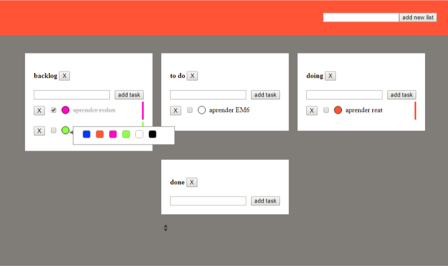

#  Scrum Board with jQuery - ACTIVIDAD 1

Vamos a crear una app web con HTML, CSS, JS y jQuery. 

La misión del app es poder gestionar la metodología scrum. De modo que tengamos listas que contienen tareas.

## BackLog

- [X] Layout responsive con flexbox
- [X] Mejorar el estilo del boceto
- [x] Añadir listas nuevas
- [x] Borrar listas
- [X] Añadir tareas a las listas /Impoortante
- [X] Borrar tareas /Impoortante

Opcional:

- [ ] Marcar tarea como completada
- [X] Editar texto de la tarea.
- [ ] Cambiar el color de las tareas individualmente (Se debe buscar un plugin de terceros de color-picker)
- [ ] Guardar el estado en localStorage

## Boceto

